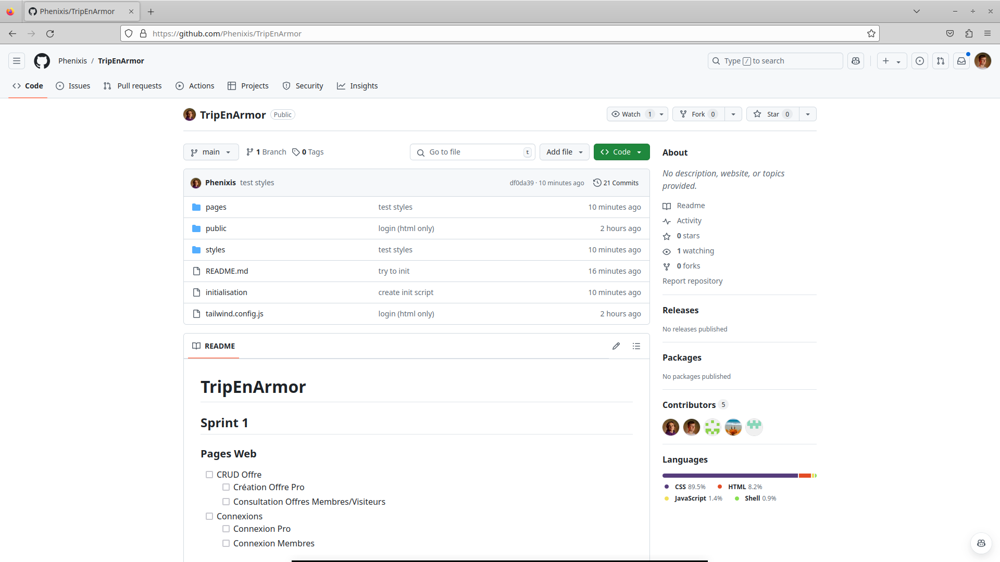
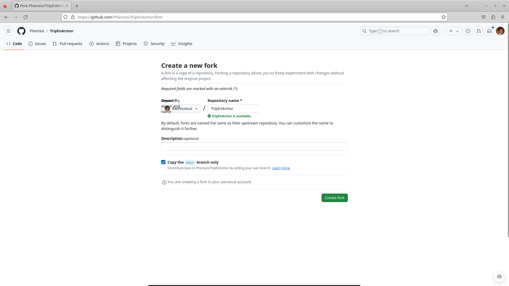
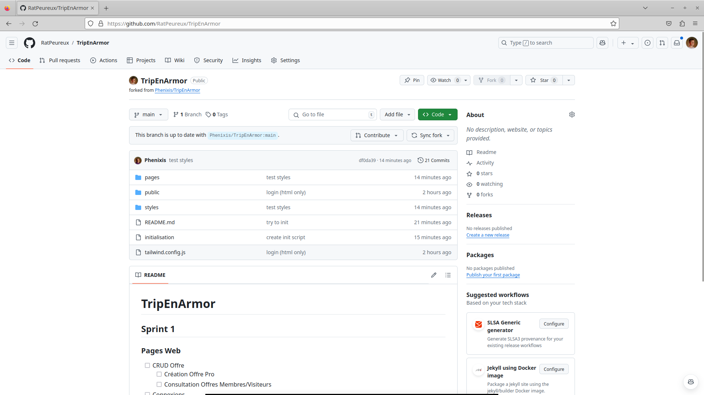
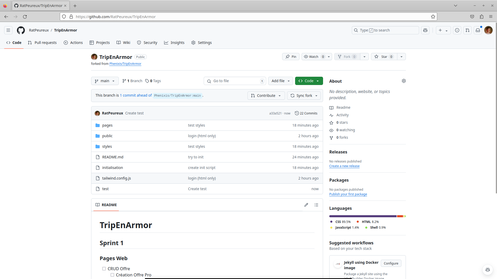
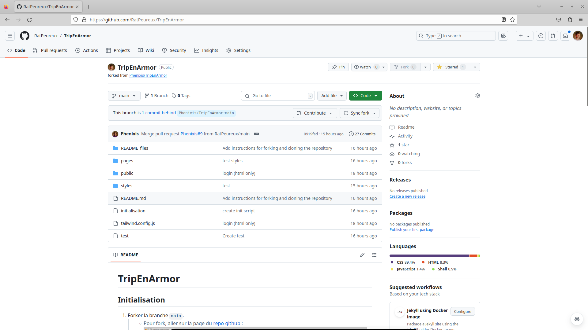
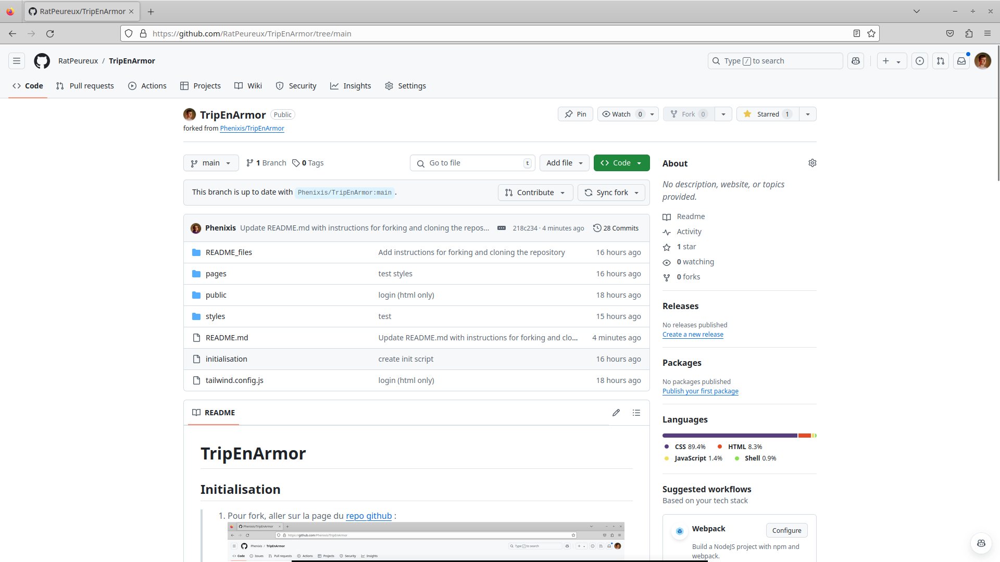
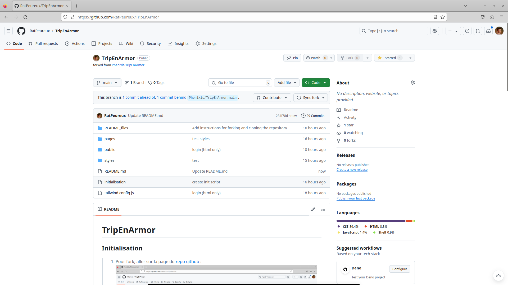
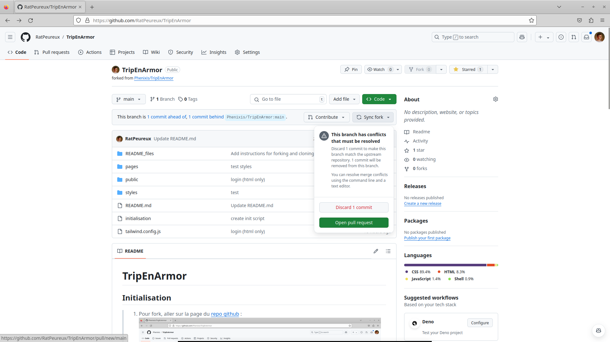

# TripEnArmor

[JIRA!](https://sae3projets.atlassian.net/jira/software/projects/C22/boards/1/backlog)

## Initialisation

1. Pour fork, aller sur la page du [repo github](https://github.com/Phenixis/TripEnArmor) : 
1. Cliquez le bouton `fork (0)` en haut à droite du repo 
1. Puis cliquez sur `Create fork`.
1. Maintenant, vous devriez voir un repo du même nom(`TripEnArmor`) avec un `forked from Phenixis/TripEnArmor` 
1. Maintenant, cloner ce fork sur votre machine et faites toutes les modifications que vous voulez dessus. Une fois les modifications faites, commitées et push (ici la création d'un fichier `test`), vous pourrez créer une `Pull Request(PR)` en cliquant sur `Contribute`, puis `Open pull request`. 
1. Une fois cette PR ouverte, on la reviewera le lendemain matin au Daily Meeting et elle sera mélangée avec le reste du code. Étant donné que toutes les PRs seront mélangées entre elle, il faudra **chaque matin** récupérer les modifications faites sur le repo originel (`Phenixis/TripEnArmor`).

## Comment

### Synchroniser son repo personnel avec le repo d'origine

1. Ici, vous voyez que le repo de Léo est en retard d'un commit (`1 commit behind`) sur le repo d'origine 
1. Pour synchroniser la branche, il faut cliquer sur `Sync Fork` puis `Update branch`. La branche devrait maintenant être à jour : 

#### EN CAS DE CONFLIT

_AKA_ : le repo d'origine a modifié un fichier que vous avez aussi modifié

1. La manipulation est un peu différente. Ici, le commit du repo d'origine et le repo de Léo ont modifiés le fichier README. Il y a donc conflit. 
1. Lorsque vous voudrez `Sync fork`, il vous proposera de `Open pull request` ou de `Discard X commit.s` : 
1. Vous avez 2 choix :
    1. `Open pull request`: Ouvrir une Pull request et vous me notifierez qu'il faut la review rapidement pour que vous récupériez le "retard".
    1. `Discard X commit.s`: annuler ce que vous avez fait, puis synchronisez les repos.

## Sprint 1

### Pages Web

- [ ] CRUD Offre
  - [ ] Création Offre Pro
  - [ ] Consultation Offres Membres/Visiteurs
- [ ] Connexions
  - [ ] Connexion Pro
  - [ ] Connexion Membres

### BDD

- [ ] Script création BDD

### Etape finale

- [ ] Connexion BDD <Pages Web
